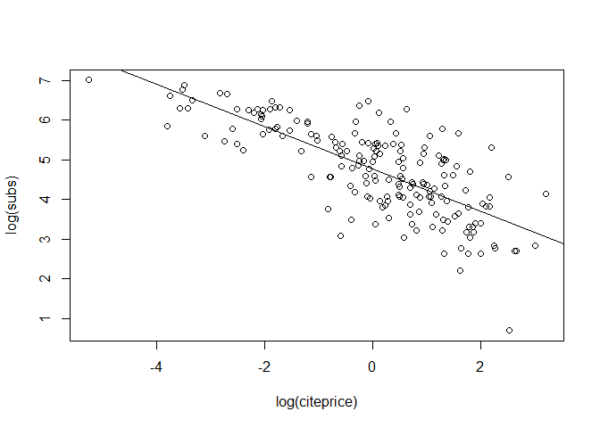
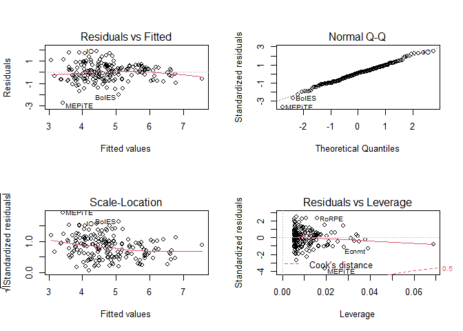

# Regresión lineal simple

### Creación dataframe: journals

Primero hay que cargar el dataset “Journals” junto con las librerias:

``` r
library("car")
```

    ## Loading required package: carData

``` r
library("AER")
```

    ## Loading required package: lmtest

    ## Loading required package: zoo

    ## 
    ## Attaching package: 'zoo'

    ## The following objects are masked from 'package:base':
    ## 
    ##     as.Date, as.Date.numeric

    ## Loading required package: sandwich

    ## Loading required package: survival

``` r
data("Journals")
```

Ahora se guardan en otro dataframe las columnas subs y price, que serán
los datos a analizar.

``` r
journals <- Journals[, c("subs", "price")]
```

Se crea una nueva columna(citeprice) en el dataframe antes creado
(journals), que no es más que el precio por cita:

``` r
journals$citeprice <- Journals$price/Journals$citations
```

Se obtiene un resúmen del journals:

``` r
summary(journals)
```

    ##       subs            price          citeprice        
    ##  Min.   :   2.0   Min.   :  20.0   Min.   : 0.005223  
    ##  1st Qu.:  52.0   1st Qu.: 134.5   1st Qu.: 0.464495  
    ##  Median : 122.5   Median : 282.0   Median : 1.320513  
    ##  Mean   : 196.9   Mean   : 417.7   Mean   : 2.548455  
    ##  3rd Qu.: 268.2   3rd Qu.: 540.8   3rd Qu.: 3.440171  
    ##  Max.   :1098.0   Max.   :2120.0   Max.   :24.459459

### Graficación

El siguiente chunk establece la relación logarítmica entre las
suscripciones y el precio por cita.

``` r
plot(log(subs) ~ log(citeprice), data = journals)
jour_lm <- lm(log(subs) ~ log(citeprice), data = journals)
abline(jour_lm)
```


La primer línea grafica los puntos x = log(citeprice) y y = log(subs).
Mientras que la segunda línea aplica una regresión lineal por el método
OLS creando así una línea (objeto tipo lm) que relaciona las 2 variables
mencionadas. Por último, la tercer línea solamente dibuja jour_lm en la
gráfica.

### Objeto lm

El objeto lm no es un concepto de programación para expresar un tipo de
dato creado por el usuario, esto se comprueba mediante:

``` r
class(jour_lm)
```

    ## [1] "lm"

Lo cual retorna el tipo de clase, mientras que:

``` r
names(jour_lm)
```

    ##  [1] "coefficients"  "residuals"     "effects"       "rank"         
    ##  [5] "fitted.values" "assign"        "qr"            "df.residual"  
    ##  [9] "xlevels"       "call"          "terms"         "model"

Retorna los atributos del objeto. También se puede obtener información
detallada sobre los datos del objeto tipo lm, es decir: `jour_lm`:

``` r
summary(jour_lm)
```

    ## 
    ## Call:
    ## lm(formula = log(subs) ~ log(citeprice), data = journals)
    ## 
    ## Residuals:
    ##      Min       1Q   Median       3Q      Max 
    ## -2.72478 -0.53609  0.03721  0.46619  1.84808 
    ## 
    ## Coefficients:
    ##                Estimate Std. Error t value Pr(>|t|)    
    ## (Intercept)     4.76621    0.05591   85.25   <2e-16 ***
    ## log(citeprice) -0.53305    0.03561  -14.97   <2e-16 ***
    ## ---
    ## Signif. codes:  0 '***' 0.001 '**' 0.01 '*' 0.05 '.' 0.1 ' ' 1
    ## 
    ## Residual standard error: 0.7497 on 178 degrees of freedom
    ## Multiple R-squared:  0.5573, Adjusted R-squared:  0.5548 
    ## F-statistic:   224 on 1 and 178 DF,  p-value: < 2.2e-16

Como se observa la información sobre los coeficientes es relevante, esta
puede ser almacenada en otra variable de la siguiente forma:

``` r
jour_slm <- summary(jour_lm)
```

Al observar que tipo de dato(objeto) es, se ve que es `summary.lm`, es
decir, el resúmen de un lm:

``` r
class(jour_slm)
```

    ## [1] "summary.lm"

La tabla de coeficientes que se mencionó se puede observar corriendo el
siguiente código:

``` r
jour_slm$coefficients
```

    ##                  Estimate Std. Error   t value      Pr(>|t|)
    ## (Intercept)     4.7662121 0.05590908  85.24934 2.953913e-146
    ## log(citeprice) -0.5330535 0.03561320 -14.96786  2.563943e-33

### Análisis de la varianza

La función `anova()` genera un análisis de la varianza, como se observa:

``` r
anova(jour_lm)
```

    ## Analysis of Variance Table
    ## 
    ## Response: log(subs)
    ##                 Df Sum Sq Mean Sq F value    Pr(>F)    
    ## log(citeprice)   1 125.93 125.934  224.04 < 2.2e-16 ***
    ## Residuals      178 100.06   0.562                      
    ## ---
    ## Signif. codes:  0 '***' 0.001 '**' 0.01 '*' 0.05 '.' 0.1 ' ' 1

Los datos que genera este análisis son muy importantes, aquí los puntso
más importantes:  
\* Se divide en 2 filas, la primera es la variable independiente (eje x)
y la segunda la dependiente (eje y).  
\* Df indica los grados de libertad.  
\* Sum sq la suma de los cuadrados, es decir, la variación entre el
promedio de cada grupo y el promedio general.  
\* Mean sq es solo la división sum_sq/Df  
\* F-value es el test estadístico, que es la división
Mean_sq(line1)/Mean_sq(line2). \* Es el p-value, quizá la columna más
relevante, indica la relevancia estadística entre la correlación de la
variable independiente y dependiente. En este caso es menor a 0.56, por
lo que indica relevancia estadística.

### Puntos y estimación de intervalos

Para obtener el coeficiente de regresión *β*, se aplica:

``` r
coef(jour_lm)
```

    ##    (Intercept) log(citeprice) 
    ##      4.7662121     -0.5330535

Aunque se trata de un estimado del coeficiente *β* para las 2 varaibles
de la analizadas.

Para obtener un nivel de confianza de las varaibles se utiliza la
función `confint()` como en el ejemplo:

``` r
confint(jour_lm, level = 0.95)
```

    ##                     2.5 %     97.5 %
    ## (Intercept)     4.6558822  4.8765420
    ## log(citeprice) -0.6033319 -0.4627751

### Predicciones

Una vez se tiene el modelo, este se suele utilizar para realizar
predicciones de futuros datos. Las predicciones son del tipo: dado los
datos observados y el modelo de regresión lineal, ¿cuál será el proximo
dato observado dada la variable x?  
En este caso se busca qué dato se obtendria dada la variable
`citeprice = 2.11`, para ello se utiliza la función `predict()`, la cual
tiene 2 tipos de predicciones:

``` r
predict(jour_lm, newdata = data.frame(citeprice = 2.11), interval = "confidence")
```

    ##        fit      lwr     upr
    ## 1 4.368188 4.247485 4.48889

``` r
predict(jour_lm, newdata = data.frame(citeprice = 2.11), interval = "predict")
```

    ##        fit      lwr      upr
    ## 1 4.368188 2.883746 5.852629

La salida es una tabla que indica el límite superior e inferior entre
los que se puede encontrar el dato a observar cuando el `citeprice` sea
2.11, esto basado en las tablas de distribución t.

Como se puede intuir del análisis anterior, es posible obtener todo un
rango de posibles valores en y dados una serie de valores en x, para
ello se genera primero la secuencia de valores en x: `lciteprice` y
continuación un data frame que contenga las predicciones de datos en
dicho rango de valores dado el modelo de regresión lineal, esto es lo
que se hace en las siguientes lineas:

``` r
lciteprice <- seq(from = -6, to = 4, by = 0.25)
jour_pred <- predict(jour_lm, interval = "prediction", newdata = data.frame(citeprice = exp(lciteprice)))
```

Ahora sería más útil graficar la predicción, los datos y el modelo de
regresión, para ello:

``` r
plot(log(subs) ~ log(citeprice), data = journals)
lines(jour_pred[, 1] ~ lciteprice, col = 1)
lines(jour_pred[, 2] ~ lciteprice, col = 1, lty = 2)
lines(jour_pred[, 3] ~ lciteprice, col = 1, lty = 2)
```


La primer línea grafica los datos, tal como se hizo al principio de este
documento, posteriormente se llama a la función `lines` que como su
nombre lo dice grafica lineas, y se pasa como parametros los 3 valores
de la predicción (intervalo menor, mayor y el modelo de regresión).

### Graficación de un objeto lm

La función `plot` puede generar 6 gráficas de un objeto lm, aunque por
defectuo grafica 4, el siguiente código muestra estas 4 gráficas en una
sola imagen:

``` r
par(mfrow = c(2, 2))
plot(jour_lm)
```



``` r
par(mfrow = c(1, 1))
```

Las gráficas suelen ser utilizadas para el análisis de residuos, aunque
aquí no se ahondará en su significado.

### Probar hipótesis lineal

La función `linearHypothesis()` evalua una hipótesis en un modelo de
regresión lineal(objeto lm), de forma que para el caso analizado esto
sería:

``` r
linearHypothesis(jour_lm, "log(citeprice) = -0.5")
```

    ## Linear hypothesis test
    ## 
    ## Hypothesis:
    ## log(citeprice) = - 0.5
    ## 
    ## Model 1: restricted model
    ## Model 2: log(subs) ~ log(citeprice)
    ## 
    ##   Res.Df    RSS Df Sum of Sq      F Pr(>F)
    ## 1    179 100.54                           
    ## 2    178 100.06  1   0.48421 0.8614 0.3546

La hipótesis se interpreta como buscar la probabilidad de que la
elasticidad del precio por cita es igual a -0.5, el dato más importante
en este caso es el valor de p (última columna), que en este caso es de
0.3546, lo cual indica que la hipótesis tiene significancia estadística,
o en otras palabras, la elasticidad se encuentra cerca de -0.5.
